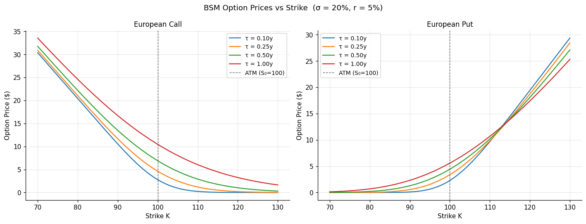
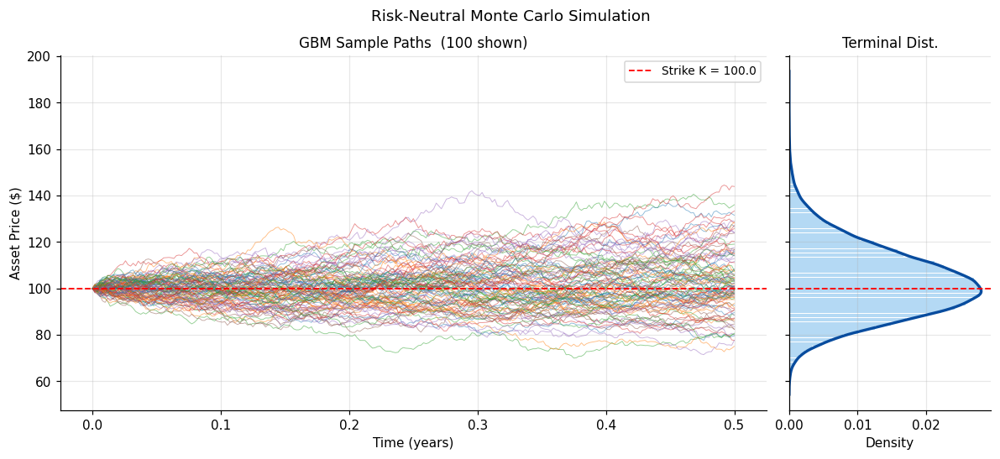
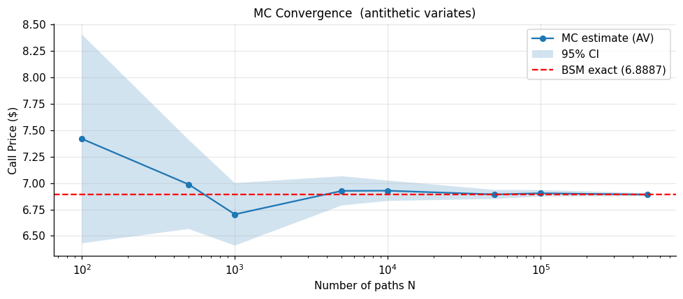
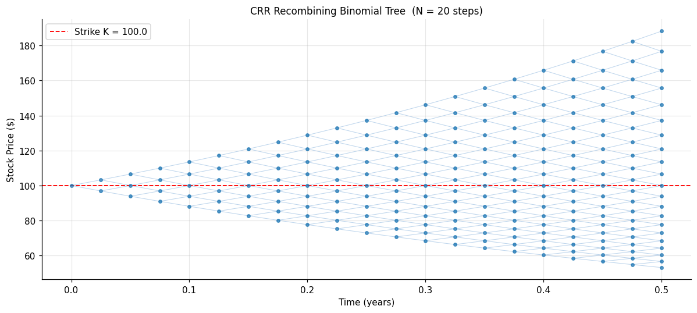
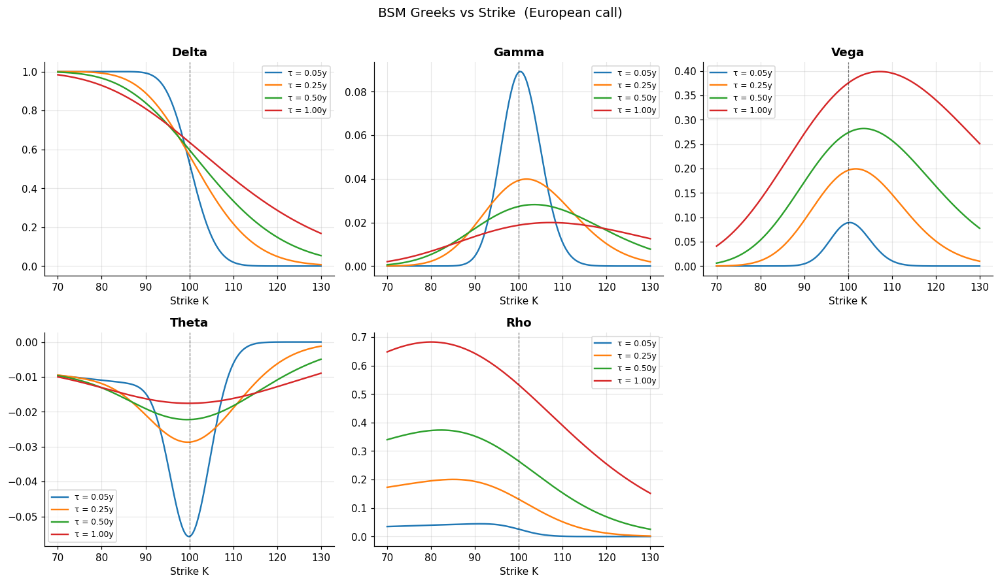
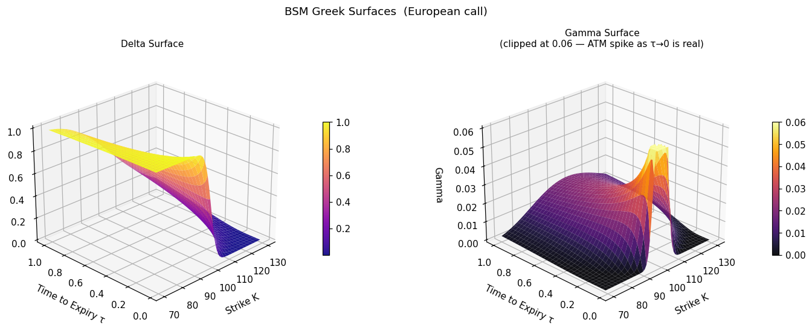

# Option Pricing: Classical Methods and Risk Analytics

This repository contains an options pricing project completed during my Master's in Quantitative Finance at **USI Lugano**. The project implements and compares three classical approaches to pricing **European vanilla options** under the Black-Scholes-Merton framework, and analyses option risk sensitivities and implied volatility.

---

## Overview

The project is structured around the following components:

- **Black-Scholes-Merton (BSM)**  
  Closed-form pricing of European calls and puts via the BSM PDE solution under the risk-neutral measure. Includes put-call parity verification and price curves across strikes and maturities.

- **Monte Carlo Simulation**  
  Risk-neutral pricing via simulation of the GBM terminal distribution (exact, no discretisation error). Antithetic variates are used for variance reduction. Convergence to the BSM benchmark is illustrated across path counts from 100 to 500,000.

- **CRR Binomial Tree**  
  Discrete-time recombining lattice with backward induction. Fully vectorised implementation. Convergence to BSM at rate O(1/N) is demonstrated, with the characteristic oscillatory bias noted near ATM strikes.

- **Model Comparison**  
  All three methods are evaluated at identical ATM parameters and compared against the BSM reference price.

- **Option Greeks**  
  Closed-form BSM Greeks (Delta, Gamma, Vega, Theta, Rho) computed and visualised as functions of strike and maturity, including 3D surfaces for Delta and Gamma.

- **Implied Volatility**  
  BSM inversion via Brent's method to recover implied volatility from market prices. Includes a 2D synthetic equity skew and a 3D implied volatility surface with negative skew and term structure.

---

## Files

- **`option_pricing.ipynb`**  
  Main notebook containing all theory, implementation, and visualisations.

- **`plots/`**  
  Folder containing all figures produced by the notebook.

---

## Results

Below are selected visual outputs from the analysis.

- **BSM Option Prices vs Strike**  
  European call and put prices across strikes and maturities under BSM.

  

- **Monte Carlo Simulation**  
  Risk-neutral GBM sample paths with the log-normal terminal distribution at T = 0.5y.

  

- **MC Convergence**  
  Antithetic-variate MC estimator converging to the BSM benchmark as the number of paths increases.

  

- **CRR Recombining Binomial Tree**  
  Stock price lattice for N = 20 steps, illustrating the recombining structure and strike placement.

  

- **BSM Greeks vs Strike**  
  All five Greeks plotted against strike for multiple maturities, showing the near-expiry gamma spike and theta trough ATM.

  

- **BSM Greek Surfaces**  
  3D Delta and Gamma surfaces over the strike–maturity plane. Gamma is clipped at 0.06 for visibility; the ATM spike as τ → 0 is real.

  

---

## User Guide

1. **Setup**
   ```bash
   git clone https://github.com/your-username/option-pricing.git
   cd option-pricing
   pip install numpy scipy matplotlib
   ```

2. **Execution**
   - Open `option_pricing.ipynb` in Jupyter or VS Code.
   - Run all cells top to bottom.
   - All figures are generated inline and saved to `plots/`.

3. **Requirements**
   - Python 3.9+
   - `numpy`, `scipy`, `matplotlib` (no additional dependencies)

---

## Contact

For questions or feedback, feel free to email me at **alessandro.dodon@usi.ch**.  
You can also connect via [LinkedIn](https://github.com/Alessandro-Dodon) through my GitHub profile.
